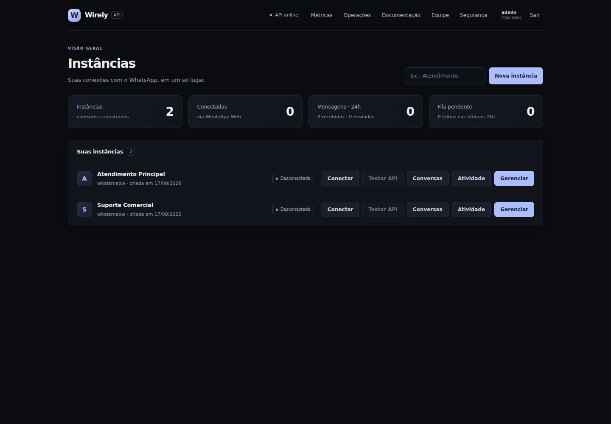
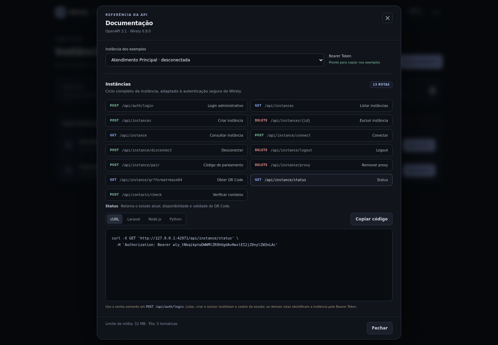
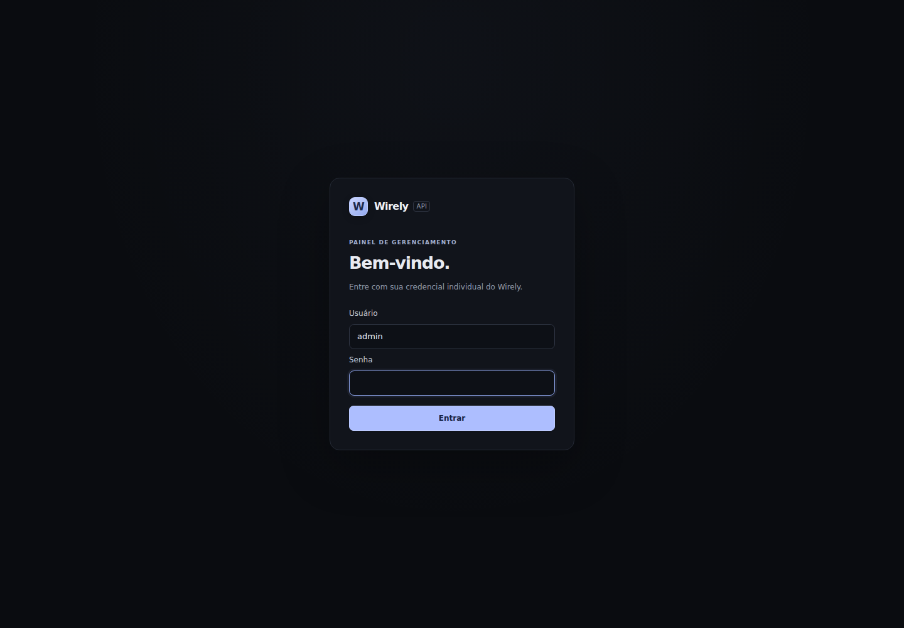

# Wirely API

Wirely API is a self-hosted messaging API and management panel. The backend is
written in Go and the panel uses React, TypeScript, and Vite.

> The project is in its initial development phase and is not ready for production.

## Screenshots

### Dashboard



### API documentation



### Login



## Current features

- Single Go binary with the React panel embedded
- SQLite persistence without CGO
- Initial administrator bootstrap
- Server-side sessions using HttpOnly cookies
- Multi-user team access with owner, administrator, operator, and read-only viewer roles
- Administrator password change with automatic session revocation
- Instance creation, listing, connection, disconnection, and removal
- WhatsApp Web pairing with a rotating QR Code
- Isolated whatsmeow SQLite storage per instance
- Automatic reconnection for paired sessions
- Per-instance API authentication via SHA-256 hashes, with AES-256-GCM encrypted token copies for administrator display
- Text, location, contact, poll, reaction, plus unified image, video, audio, document, and sticker sending through the Bearer-authenticated API
- Persistent per-instance message queue with scheduling, idempotency, automatic retries, cancellation, and manual retry
- Built-in API playground for testing all supported message types
- Integrated API reference with cURL, Laravel, Node.js, and Python examples
- OpenAPI 3.1 specification at `GET /openapi.json`
- Instance management modal with tokens, filtered webhooks, disconnect and delete
- Per-instance signed webhooks with automatic retries and delivery logs
- Per-instance activity history with filters, pagination, live refresh, and manual retry
- Administrator inbox with WhatsApp contacts, unread counters, chat history, and direct or group replies
- Group management with creation, participants, administrators, invite rotation, and invite joining
- WhatsApp profile management for name, about, photo, and privacy settings
- Operational metrics dashboard with 24-hour, 7-day, and 30-day views
- Prometheus endpoint at `GET /metrics`, operational alerts, and structured JSON logs
- Persistent administrative audit trail, login lockout, and per-instance API rate limiting
- Daily automatic backups, owner-only panel restore, downloads, retention, and pre-restore safety copies
- Complete OpenAPI coverage for public and administrative routes
- Health endpoint at `GET /api/health`
- Shell installer and hardened systemd service
- Dashboard update card with release notes, automatic backup, SHA-256 verification, and binary rollback

## Requirements for development

- Go 1.26+
- Node.js 22+
- npm

Node.js is only required to develop and compile the panel. Production runs only
the generated Go binary.

## Installation without Docker

On a Linux server with systemd, clone the repository and run the installer:

```bash
git clone https://github.com/romariosribeiro/wirely-api.git && \
  cd wirely-api && \
  sudo ./install.sh --open-firewall
```

The default port is `8080`. To install on another port and open that same port
in UFW or iptables, use:

```bash
sudo ./install.sh --open-firewall --port 3000
```

The compact form `--port-3000` is also accepted.

The installer:

- obtains temporary, SHA-256-verified Go and Node.js toolchains when needed;
- compiles the React panel and the Go binary;
- installs the final binary at `/home/USER/wirely/wirely`;
- runs systemd with the Linux user that invoked `sudo`;
- keeps configuration in `/home/USER/wirely/wirely.env`;
- keeps databases and sessions in `/home/USER/wirely/data`;
- enables and starts the hardened systemd service.
- installs an isolated systemd update helper; the API can only stage verified
  files inside its data directory and cannot overwrite its own installation.

The owner dashboard checks stable GitHub releases every 15 minutes. Applying an
update creates a `pre-update` backup, validates the official SHA-256 file,
preserves the previous binary as `wirely.previous`, and restarts Wirely. The
button remains disabled when no compatible verified release artifact is available.

For the standard Ubuntu user, everything is placed under `/home/ubuntu/wirely`.

Node.js is not used by the running service. Run `sudo ./install.sh` again to
upgrade while preserving configuration and data. Use `--secure-cookie` only
after putting Wirely behind HTTPS.

The initial `admin` owner password is printed once during installation. It can
also be read immediately after the first start with:

```bash
sudo journalctl -u wirely.service --since "5 minutes ago" | grep '"initial_password"'
```

Useful installer options are available through `./install.sh --help`. The
`--build-only` option verifies the complete build without changing the system.

To migrate an older Wirely data directory, run:

```bash
sudo ./install.sh --migrate-from /var/lib/wirely
```

The source directory is preserved after migration.

## API design references

Wirely uses the Evolution Go documentation as a behavioral reference, while
keeping its own concise routes and Bearer-token instance identification. The
reference catalog starts at [Get all instances](https://docs.evolutionfoundation.com.br/evolution-go/get-all-instances).
The current API was compared with the documented contracts for
[text messages](https://docs.evolutionfoundation.com.br/evolution-go/send-a-text-message),
[contact messages](https://docs.evolutionfoundation.com.br/evolution-go/send-a-contact-message),
[group creation](https://docs.evolutionfoundation.com.br/evolution-go/create-group),
[group listing](https://docs.evolutionfoundation.com.br/evolution-go/list-groups),
[user checks](https://docs.evolutionfoundation.com.br/evolution-go/check-a-user),
[newsletter creation](https://docs.evolutionfoundation.com.br/evolution-go/create-newsletter),
[label editing](https://docs.evolutionfoundation.com.br/evolution-go/edit-label), and
[community creation](https://docs.evolutionfoundation.com.br/evolution-go/create-community).

## Development

```bash
make web-install
```

Start the Go API:

```bash
make dev
```

In another terminal, start Vite:

```bash
cd web
npm run dev
```

The API runs at `http://localhost:8080` and Vite at
`http://localhost:5173`.

## Production build

```bash
make build
WIRELY_DATA_DIR=./data ./bin/wirely
```

At the first start, Wirely generates the `admin` owner password and prints it once
in the service log. Only its PBKDF2-SHA256 hash is stored.

Available environment variables:

| Variable | Default | Description |
| --- | --- | --- |
| `WIRELY_ADDRESS` | `:8080` | HTTP listen address |
| `WIRELY_DATA_DIR` | `./data` | SQLite and persistent data directory |
| `WIRELY_SECURE_COOKIE` | `false` | Require HTTPS for the session cookie |
| `WIRELY_QUEUE_RATE` | `1s` | Minimum interval between queued sends for each instance (`0` disables throttling) |
| `WIRELY_API_RATE_LIMIT` | `120` | Public Bearer-authenticated requests allowed per instance per minute |
| `WIRELY_BACKUP_INTERVAL` | `24h` | Automatic backup interval (`0` disables automatic execution) |
| `WIRELY_BACKUP_RETENTION` | `7` | Number of local backup archives retained |

## Send messages

Each instance has its own Bearer token. Administrators can always view and copy
the current token in **Gerenciar**, including after reopening the panel or restarting
the service. Reading never rotates the token; **Gerar token** invalidates the old one.
The **Testar API** button on a connected instance opens a playground that exercises
the same public endpoints used by external integrations. **Documentação** in the
top navigation generates copy-ready cURL, Laravel, Node.js, and Python examples
using the selected instance. The machine-readable OpenAPI 3.1 specification is
available at `GET /openapi.json` and `GET /api/openapi.json`.

| Type | Endpoint | Body |
| --- | --- | --- |
| Text | `POST /api/send/text` | JSON with `recipient` and `message` |
| Media | `POST /api/send/media` | Multipart with `recipient`, `type`, `file`, and optional fields |
| Location | `POST /api/send/location` | JSON with `recipient`, `latitude`, `longitude`, and optional place details |
| Contact | `POST /api/send/contact` | JSON with `recipient`, `fullName`, `phone`, and optional `organization` |
| Poll | `POST /api/send/poll` | JSON with `recipient`, `question`, `choices`, and `maxAnswer` |
| Reaction | `POST /api/send/reaction` | JSON with `recipient`, `messageId`, `reaction`, and optional target metadata |

Message and chat actions use the same instance Bearer token:

| Action | Endpoint | Body |
| --- | --- | --- |
| Delete for everyone | `POST /api/messages/delete` | `chat`, `messageId`, and optional group `participant` |
| Edit text | `POST /api/messages/edit` | `chat`, `messageId`, and `message` |
| Mark as read | `POST /api/messages/read` | `chat`, `messageIds`, and optional group `participant` |
| Message status | `GET /api/messages/{messageID}/status` | No body |
| Archive or unarchive | `POST /api/chats/archive` | `chat` and optional `archived` |
| Mute | `POST /api/chats/mute` | `chat` and optional `durationSeconds`; zero means indefinitely |
| Pin | `POST /api/chats/pin` | `chat` |
| Unpin | `POST /api/chats/unpin` | `chat` |

`chat` accepts an international phone number without `+` or a WhatsApp chat
JID. Message status is resolved from the latest persisted WhatsApp receipt and
is isolated to the instance authenticated by the Bearer token.

## Newsletters, labels, and communities

Wirely also exposes Bearer-authenticated operations to create, inspect, list,
read, and subscribe to WhatsApp newsletters; edit labels and associate them
with chats or messages; and create communities or link/unlink existing groups.
The complete contracts and examples are available in the in-app documentation
and OpenAPI specification. Community membership in this API refers to linked
groups (`groupJids`), matching WhatsApp's community model, not individual users.

The required media `type` is `image`, `video`, `audio`, `document`, or
`sticker`. Uploads are limited to 32 MB and the MIME type is validated. Use
`caption` with images, videos, and documents; use `voice=true` only for
OGG/Opus audio. Stickers must be WebP and do not accept captions. All endpoints
require the instance token in the `Authorization: Bearer wly_...` header.
Synchronous sends accept optional `options` with `presence` set to
`composing` or `recording` and `delay` between `0` and `60000`
milliseconds. Wirely publishes the chat presence, waits, sends the message,
and clears the status with `paused`.

### Text

```bash
curl -X POST https://wirely.example.com/api/send/text \
  -H "Authorization: Bearer wly_your_token" \
  -H "Content-Type: application/json" \
  -d '{"recipient":"5511999999999","message":"Hello from Wirely","options":{"presence":"composing","delay":2000}}'
```

### Media

Only `type` and the file change between image, video, audio, document, and
sticker:

```bash
curl -X POST https://wirely.example.com/api/send/media \
  -H "Authorization: Bearer wly_your_token" \
  -F "recipient=5511999999999" \
  -F "type=video" \
  -F 'options={"presence":"composing","delay":2000}' \
  -F "caption=Video from Wirely" \
  -F "file=@./video.mp4;type=video/mp4"
```

### Location, contact, poll, and reaction

These endpoints use JSON and the same Bearer token. The recipient accepts a
phone number with country code; the structured-message endpoints also accept a
group JID. Polls support 2 to 12 unique options. Send an empty `reaction` to
remove the current reaction; for received group messages, include the target
message author's `participant` and leave `fromMe` false.

```bash
curl -X POST http://localhost:8080/api/send/poll \
  -H "Authorization: Bearer wly_your_token" \
  -H "Content-Type: application/json" \
  -d '{"recipient":"5511999999999","question":"Which time?","choices":["09:00","14:00"],"maxAnswer":1,"options":{"presence":"composing","delay":2000}}'
```

A successful request returns the WhatsApp receipt:

```json
{
  "id": "3EB0...",
  "recipient": "5511999999999",
  "timestamp": "2026-09-16T20:30:00Z",
  "type": "video"
}
```

## Metrics and observability

Open **Métricas** in the top navigation for a live operational overview. The
dashboard refreshes every 15 seconds and supports `24h`, `7d`, and `30d` ranges.
It reports:

- sent and received message events;
- current queued, processing, and retrying jobs;
- completed, failed, and canceled queue jobs in the selected period;
- webhook delivery success rate and average response time;
- connected instances and per-instance breakdowns;
- service uptime since the current process started.

Viewer, operator, administrator, and owner roles can read the endpoint using the
panel's HttpOnly session cookie:

```bash
curl --cookie 'wirely_session=YOUR_SESSION' \
  'https://wirely.example.com/api/metrics?range=24h'
```

The queue's pending count is a current snapshot, while terminal queue states,
messages, and webhook deliveries use the selected time range. Webhook success is
calculated per delivery attempt. Retained history follows Wirely's 30-day
cleanup policy, so older results may be incomplete.

## Operations, security, and recovery

Open **Operações** in the top navigation. Every authenticated role can see
operational alerts. Administrators and the owner can inspect the audit trail;
only the owner can access backup files or start a restore.

Five failed logins for the same username and source IP within 15 minutes block
that combination for 15 minutes, including attempts with the correct password.
Public Bearer endpoints allow 120 requests per minute per instance by default and
return `429`, `Retry-After`, and `RateLimit-*` headers when exceeded.

Wirely creates a backup every 24 hours by default. SQLite databases are captured
through consistent online snapshots; session files, the token encryption key,
and queued media are included. Archives live in
`WIRELY_DATA_DIR/backups` with private permissions. A restore always creates a
new pre-restore backup, stages the selected archive, and restarts the systemd
service. The archive is applied before any database opens.

Prometheus-compatible metrics are available at `GET /metrics`. This endpoint
contains aggregate operational values and no instance names, tokens, message
content, or webhook secrets. The JSON dashboard remains at
`GET /api/metrics`; active alerts are at `GET /api/alerts`; audit entries
are at `GET /api/audit`. Application and HTTP request logs are emitted as
one JSON object per line for journal ingestion.

## Reliable message queue

The synchronous `/api/send/*` endpoints remain available when the caller needs
the WhatsApp result immediately. For durable integrations, use the equivalent
`/api/queue/*` endpoints. Jobs are persisted in SQLite before they are accepted,
survive service restarts, and are isolated by the Bearer token's instance.

| Type | Enqueue endpoint |
| --- | --- |
| Text | `POST /api/queue/text` |
| Image, video, audio, document, or sticker | `POST /api/queue/media` |

Text uses the same JSON body as synchronous sending. Media uses the same multipart
fields. Add an optional `scheduledAt` RFC 3339 field to schedule up to 365 days in
the future. A new job returns `202 Accepted`, its representation, and a `Location`
header. The following endpoints control it:

- `GET /api/queue/{jobID}` returns the current state;
- `DELETE /api/queue/{jobID}` cancels a queued or retrying job;
- `POST /api/queue/{jobID}/retry` restarts a terminal failed job.

Use a stable `Idempotency-Key` header for each logical request. Repeating the same
key and content returns the original job with `200 OK` and
`Idempotent-Replayed: true`. Reusing it with different content or scheduling
returns `409 Conflict`.

```bash
curl -X POST https://wirely.example.com/api/queue/text \
  -H "Authorization: Bearer wly_your_token" \
  -H "Idempotency-Key: order-123" \
  -H "Content-Type: application/json" \
  -d '{"recipient":"5511999999999","message":"Queued by Wirely"}'
```

Job states are `queued`, `processing`, `retrying`, `sent`, `failed`, and
`canceled`. Transient failures are retried after approximately 5 seconds,
15 seconds, 1 minute, and 5 minutes, for at most five attempts total. The
`WIRELY_QUEUE_RATE` setting limits the sending pace independently for each
instance. Administrators can filter, cancel, and retry jobs in **Atividade → Fila**.

Queued media is stored under `WIRELY_DATA_DIR/outbox` with private permissions.
It is deleted after success or cancellation; terminal records and retained failed
media are pruned after 30 days. Protect and back up the complete data directory.

Delivery is *at least once*. A process failure after WhatsApp accepts a message but
before the local transaction completes can cause a retry, so downstream workflows
must tolerate a rare duplicate. The idempotency key prevents duplicate API requests
from creating multiple jobs, but it cannot eliminate this transport-level edge case.

### Token storage

Authentication uses a SHA-256 hash. A separate AES-256-GCM encrypted copy is
returned only by the admin-session-protected `GET /api/instances/{id}/token`
endpoint, with `Cache-Control: no-store`; instance lists never contain tokens.
Tokens from older installations have only a hash and remain valid, but require
one manual rotation to become visible (`regenerationRequired: true`).

The encryption key is generated automatically at `WIRELY_DATA_DIR/token.key`
with permissions `0600`. Include it in secure backups together with the database
and WhatsApp sessions. Do not commit it or delete it: without the original key,
encrypted tokens cannot be recovered. Startup fails if encrypted tokens exist
but the key is missing, instead of silently replacing it. Protect the entire data
directory: encryption does not protect tokens if both the database and key are
compromised. Use HTTPS in production to protect credentials in transit.


## Team access and roles

The original `admin` account is migrated automatically to the protected
**Owner** account, preserving its password and active sessions. Open **Equipe**
in the top navigation to create individual credentials, change roles, block
access, reset passwords, or remove a user.

| Role | Access |
| --- | --- |
| Viewer | Read instances, conversations, contacts, activity, webhook history, and queue state |
| Operator | Viewer access plus connect/disconnect, reply to conversations, cancel/retry queue jobs, and retry webhooks |
| Administrator | Operator access plus create/delete instances, API tokens, webhooks, pairing QR Codes, and the API playground |
| Owner | Administrator access plus user and role management, backup download, deletion, and restore |

Only the owner can manage the team, and the owner account cannot be disabled,
demoted, or deleted. Users cannot assign the owner role. Every role check is
enforced by the Go API; hiding a button in React is only an additional usability
layer.

Changing a user's role, enabling/disabling the account, resetting its password,
or deleting it immediately revokes all of that user's sessions. A user's own
password change also revokes their sessions and requires a new login. Passwords
must contain 12 to 128 characters and are stored using PBKDF2-SHA256.

Administrative team endpoints use the panel's HttpOnly `wirely_session` cookie:

- `GET /api/users`
- `POST /api/users`
- `PATCH /api/users/{userID}`
- `PUT /api/users/{userID}/password`
- `DELETE /api/users/{userID}`

These endpoints are included in the OpenAPI specification. Do not expose the
panel over plain HTTP in production; place Wirely behind HTTPS and set
`WIRELY_SECURE_COOKIE=true`.

## Instance lifecycle API

Wirely keeps global administration separate from instance integrations. Listing,
creating, and permanently deleting instances require an authenticated panel
session:

```bash
curl -X POST 'http://localhost:8080/api/auth/login' \
  -H 'Content-Type: application/json' \
  -c wirely.cookies \
  -d '{"username":"admin","password":"SUA_SENHA"}'

curl 'http://localhost:8080/api/instances' \
  -b wirely.cookies

curl -X POST 'http://localhost:8080/api/instances' \
  -H 'Content-Type: application/json' \
  -b wirely.cookies \
  -d '{"name":"Atendimento","alwaysOnline":false,"rejectCall":false,"msgRejectCall":"","readMessages":false,"ignoreGroups":false,"ignoreStatus":false}'
```

The password is sent only to `POST /api/auth/login`. Subsequent administrative
requests reuse the HttpOnly session cookie.

| Method | Endpoint | Operation |
| --- | --- | --- |
| `GET` | `/api/instances` | List every instance |
| `POST` | `/api/instances` | Create an instance and its first token |
| `GET` | `/api/instances/{id}/settings` | Read instance behavior settings |
| `PUT` | `/api/instances/{id}/settings` | Update online, call, read, group, and Status behavior |
| `DELETE` | `/api/instances/{id}` | Permanently delete an instance |

All remaining operations use the instance Bearer token, which means an
integration never sends an instance ID:

| Method | Endpoint | Operation |
| --- | --- | --- |
| `GET` | `/api/instance` | Get the authenticated instance |
| `POST` | `/api/instance/connect` | Start or restore the connection |
| `POST` | `/api/instance/disconnect` | Disconnect without unlinking |
| `DELETE` | `/api/instance/logout` | Unlink the WhatsApp account |
| `POST` | `/api/instance/pair` | Request a phone pairing code |
| `DELETE` | `/api/instance/proxy` | Clear the active proxy |
| `GET` | `/api/instance/qr` | Download the current QR Code as PNG |
| `GET` | `/api/instance/qr?format=base64` | Read the QR Code as Base64 JSON |
| `GET` | `/api/instance/status` | Read connection and QR state |

Connect and configure the instance's single webhook in the same request:

```bash
curl -X POST 'http://localhost:8080/api/instance/connect' \
  -H 'Authorization: Bearer wly_your_token' \
  -H 'Content-Type: application/json' \
  -d '{
    "subscribe":["MESSAGE","SEND_MESSAGE","READ_RECEIPT","PRESENCE","HISTORY_SYNC","CHAT_PRESENCE","CALL","CONNECTION","LABEL","CONTACT","GROUP","NEWSLETTER","QRCODE"],
    "webhookUrl":"https://your-domain.example/webhook"
  }'
```

Without `phone`, the request waits up to 30 seconds and returns the current QR
Code in `data.qrCode.data` as Base64 when it becomes available. The response
also includes `data.status`, `data.qrAvailable`, the normalized subscriptions
in `data.eventString`, the configured `data.webhookUrl`, and `data.jid`.
Omitting the body starts or restores the connection without changing the
existing webhook.

To configure the webhook and request a phone pairing code in the same call, add
the international phone number without `+`:

```bash
curl -X POST 'http://localhost:8080/api/instance/connect' \
  -H 'Authorization: Bearer wly_your_token' \
  -H 'Content-Type: application/json' \
  -d '{
    "phone":"5511999999999",
    "subscribe":["MESSAGE","CONNECTION","QRCODE"],
    "webhookUrl":"https://your-domain.example/webhook"
  }'
```

This mode returns `data.pairingCode` and `data.expiresIn`.

The dedicated pairing endpoint remains available for integrations that prefer a
separate call. It expects an international phone number without `+`:

```bash
curl -X POST 'http://localhost:8080/api/instance/pair' \
  -H 'Authorization: Bearer wly_your_token' \
  -H 'Content-Type: application/json' \
  -d '{"phone":"5511999999999"}'
```

New pairings identify the linked device as **Google Chrome**. Existing WhatsApp
linked-device entries keep their original name until the instance is logged out
and paired again.

Check up to 100 numbers before sending a message:

```bash
curl -X POST 'http://localhost:8080/api/contacts/check' \
  -H 'Authorization: Bearer wly_your_token' \
  -H 'Content-Type: application/json' \
  -d '{"phones":["5511999999999","5511888888888"]}'
```

Each result contains `phone`, `exists`, and the canonical `jid` when available.

## Webhooks

Open **Gerenciar** on an instance to generate a token, configure its webhook,
disconnect or delete it. The current token is loaded from encrypted storage when
the modal opens. It is not stored in browser localStorage or sessionStorage.
Webhook signing secrets remain visible only when generated.

Webhooks have an enabled switch and independent event selections. Click **Salvar
webhook** to persist changes. Disabling preserves the URL, signing secret and
selection. Saving selections does not rotate the secret. Changing the URL or
using **Renovar segredo** generates a new secret, shown only at that time.

Supported selections:

| Selection | Events |
| --- | --- |
| Messages | `message.received`, `message.sent`, `message.updated`, `message.deleted`, `message.reaction`, `message.receipt` |
| Instance connection | `instance.status` |
| WhatsApp Status | `status.received`, `status.sent` |
| Presence | `presence.updated`, `presence.chat` |
| Groups | `group.updated` |
| History sync | `history.sync` |
| Calls | `call.offer`, `call.accept`, `call.reject`, `call.terminate` |
| Labels | `label.updated`, `label.chat`, `label.message` |
| Contacts | `contact.updated` |
| Newsletters | `newsletter.join`, `newsletter.leave`, `newsletter.mute`, `newsletter.live_update` |

Presence depends on events made available by WhatsApp; selecting it does not
automatically subscribe to contacts or mark the account online. Incoming image,
video, audio, document, and sticker events are downloaded, decrypted, and stored
locally before the webhook is delivered. Existing webhooks default to Messages
and Instance connection; an empty selection sends no events.

The administrative `PUT /api/instances/{id}/webhook` accepts
`{ "url": "https://example.com/events", "enabled": true, "events": ["messages", "connection"], "rotateSecret": false }`.
The original URL-only payload remains supported for existing integrations.

Common events:

- `message.received`
- `message.sent`
- `instance.status`

Each delivery is an HTTP `POST` with a JSON body:

```json
{
  "id": "evt_...",
  "event": "message.received",
  "instanceId": "instance-id",
  "timestamp": "2026-09-16T20:30:00Z",
  "data": {
    "id": "3EB0...",
    "from": "5511999999999@s.whatsapp.net",
    "chat": "5511999999999@s.whatsapp.net",
    "fromMe": false,
    "isGroup": false,
    "pushName": "Customer",
    "type": "text",
    "text": "Hello Wirely"
  }
}
```

Media events include a `media` object. `available=true` means the attachment
can be downloaded with the same instance Bearer token:

```json
{
  "id": "evt_...",
  "event": "message.received",
  "instanceId": "instance-id",
  "timestamp": "2026-09-17T12:00:00Z",
  "data": {
    "id": "3EB0ABC",
    "from": "5511999999999@s.whatsapp.net",
    "chat": "5511999999999@s.whatsapp.net",
    "fromMe": false,
    "isGroup": false,
    "type": "image",
    "text": "Comprovante",
    "media": {
      "available": true,
      "type": "image",
      "mimetype": "image/jpeg",
      "fileName": "media-3EB0ABC.jpg",
      "size": 48231,
      "downloadUrl": "/api/messages/3EB0ABC/media",
      "caption": "Comprovante",
      "savedAt": "2026-09-17T12:00:00Z"
    }
  }
}
```

### Download received media

The message ID and Bearer token identify the attachment. The default response is
the original binary file:

```bash
curl 'http://localhost:8080/api/messages/3EB0ABC/media' \
  -H 'Authorization: Bearer wly_your_token' \
  --output received-media.jpg
```

Use `format=base64` when the integration requires a JSON response:

```bash
curl 'http://localhost:8080/api/messages/3EB0ABC/media?format=base64' \
  -H 'Authorization: Bearer wly_your_token'
```

The JSON response contains `messageId`, `type`, `mimetype`, `fileName`,
`size`, and `data`. Attachments are isolated by instance, limited to 100 MB,
stored with private filesystem permissions, retained for 30 days, and removed
when the instance is deleted. Locations and contacts are delivered directly in
`data.location` and `data.contact`; reactions include `reaction` and `targetId`.

The request includes `X-Wirely-Event`, `X-Wirely-Delivery`,
`X-Wirely-Attempt`, and `X-Wirely-Signature`. Verify the signature by calculating
HMAC-SHA256 over the exact request body with the webhook secret. The signature
format is `sha256=<lowercase hexadecimal digest>`. Use `X-Wirely-Delivery` as the
idempotency key in the receiver so a repeated attempt does not run the same
business action twice.

A `2xx` response confirms delivery. Every event is stored in SQLite before it is
sent, so pending deliveries survive service restarts. Wirely makes up to five
attempts: the initial request followed by retries after 1 minute, 5 minutes,
15 minutes, and 1 hour. A valid `Retry-After` response header overrides the next
delay, capped at 24 hours. Each HTTP request has a 10-second timeout.

Test and inspect the webhook using the instance Bearer token:

```bash
# Returns HTTP 202 with an eventId
curl -X POST 'http://localhost:8080/api/webhook/test' \
  -H 'Authorization: Bearer wly_your_token'

# Inspect the persistent job returned above
curl 'http://localhost:8080/api/webhook/jobs/evt_ID' \
  -H 'Authorization: Bearer wly_your_token'

# List individual delivery attempts
curl 'http://localhost:8080/api/webhook/deliveries?status=failed&page=1&pageSize=25' \
  -H 'Authorization: Bearer wly_your_token'
```

Job states are `queued`, `processing`, `retrying`, `delivered`, and `dead`.
The test event is named `webhook.test` and is delivered even when the webhook's
event filters are narrower, provided the webhook itself is enabled.

## Conversations and contacts

The **Conversas** button opens an administrator-only inbox for an instance. The
left side lists recent conversations and the contacts cached by whatsmeow; selecting
an item opens its persisted message timeline. Incoming unread counters are local to
the Wirely panel, so opening a conversation does not automatically send a WhatsApp
read receipt. When the instance is connected, administrators can reply to individual
contacts and groups directly from the composer. Disconnected instances remain
available in read-only mode.

The inbox is intentionally based on events received and stored by this Wirely
installation. It does not import the phone's complete historical message archive.
Messages follow the same 30-day retention policy as the activity history. Contact
names come from the WhatsApp contact cache and may only appear after synchronization.

## Activity and delivery history

The **Atividade** button opens an administrator-only timeline for each instance.
It records message, connection, status, presence, and group events, along with every
webhook attempt. Delivery entries include the destination, attempt number, HTTP
status, elapsed time, error details, and whether the attempt was started manually.
Failed deliveries can be reenqueued from the activity history using the instance's
current webhook configuration and secret.

History is stored in the main SQLite database and retained for 30 days. Cleanup
runs when the service starts. Event payloads can include message text and contact
metadata, so protect `WIRELY_DATA_DIR`, restrict panel access, and include this data
in your privacy and backup policies.

Do not expose an installation containing real accounts over plain HTTP. Put
Wirely behind HTTPS and set `WIRELY_SECURE_COOKIE=true`.
